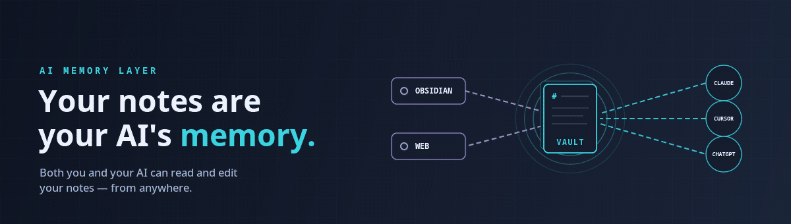

# Engram Vault Sync

> Your notes are your AI's memory.

Your vault is full of things you've figured out, half-written ideas, and notes you'll never find again. This plugin turns it into something your AI assistant can actually use — and keeps it in sync everywhere you write.

Ask Claude *"what did I decide about the kitchen reno?"* and it answers from your own notes. Search *"how do I deal with stress"* and find the note you wrote about anxiety, even though you never used that word. Edit on your laptop, pick up on your phone.

Works on desktop and mobile.

## What you get

- **Your notes, on every device.** Write on your laptop, it's on your phone. Changes your AI makes show up too.
- **Search by meaning, not keywords.** Describe what you're after in plain language and the right note surfaces — no need to remember the exact title or words.
- **An AI that knows your vault.** Connect Claude, Cursor, ChatGPT, or any other AI app and ask questions about your own notes. It can add new ones, too.

Nothing is ever silently overwritten, edits made offline sync when you reconnect, and your notes only ever go to the Engram server you choose — no third parties, no tracking.

## Try semantic search

Press `Ctrl/Cmd + P`, run **Engram: Semantic search**, and just describe what you're looking for:

> *"that recipe with the brown butter"* → finds it, even titled "Saturday pasta"
> *"reasons we picked Postgres"* → finds your architecture note
> *"feeling burned out"* → finds your journal entry from last month

Or click the 🔍 icon to keep a search sidebar open while you write.

## You'll need an Engram account

This plugin is the Obsidian half of Engram. The other half does the syncing, searching, and AI connection. Two ways to get it:

- **Hosted** — sign up at **[engram.page](https://engram.page)**. Works in minutes, free tier available, nothing to install.
- **Run it yourself** — Engram is source-available and Docker-ready. Host it on your own machine and your notes never leave your hardware. Setup lives at **[github.com/engram-app/engram](https://github.com/engram-app/engram)**.

Either way you'll get a URL and a sign-in — that's what goes in the plugin settings.

## Install

1. Open **Settings → Community plugins → Browse**.
2. Search for **Engram Vault Sync**.
3. **Install**, then **Enable**.

Requires Obsidian 1.7.2 or newer.

## Get started in 3 steps

1. **Get an account** at [engram.page](https://engram.page) (or self-host).
2. **Open the plugin settings** — *Settings → Engram Vault Sync*. Enter your Engram URL and sign in.
3. **First sync** — the plugin walks you through it. Nothing is sent until you confirm.

After that, syncing just happens as you work.

## Need more?

- **[User guide](docs/user-guide.md)** — connecting AI assistants, what gets synced, handling conflicts, the Sync Center, privacy, and troubleshooting.
- **[Developer guide](DEV.md)** — building from source, architecture, and the release process.
- **Something wrong?** [Open an issue](https://github.com/engram-app/Engram-obsidian/issues).

## Support

If this plugin saves you time, you can [buy me a coffee on Ko-fi](https://ko-fi.com/rasbandit). Optional and appreciated.

## License

[MIT](LICENSE)
